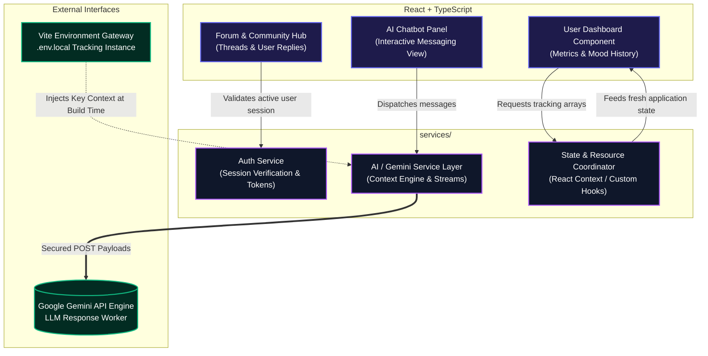
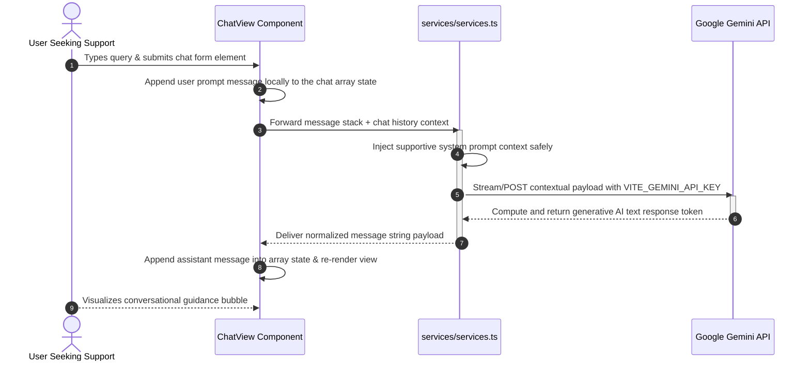
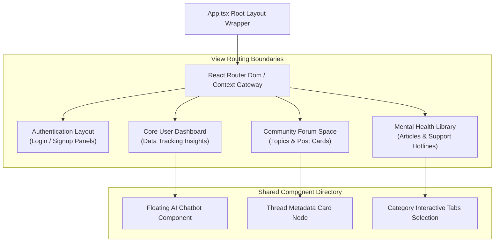

# 🧠 MindWell Connect

## 📌 Overview
MindWell Connect is a mental wellness platform that provides AI-powered assistance, resources, and community support for users.

## 🚀 Features
- 🤖 AI Chatbot (Gemini API)
- 📊 Dashboard
- 💬 Forum & Community
- 🔐 Authentication (Login/Signup)
- 📚 Resources for mental health

## 🛠 Tech Stack
- React + TypeScript
- Vite
- Gemini API

## 📦 Installation

```bash
npm install
npm run dev

🔐 Environment Variables

Create a .env.local file:
VITE_GEMINI_API_KEY=your_api_key_here

📁 Project Structure
components/
services/

🤝 Contributing
Pull requests are welcome!


## 🏗 Architecture

### Application Architecture & Data Flow Matrix


### Sequence Flow: AI Chatbot Request and Context Lifecycle



### Modular Component Structure & Page Routing Tree


